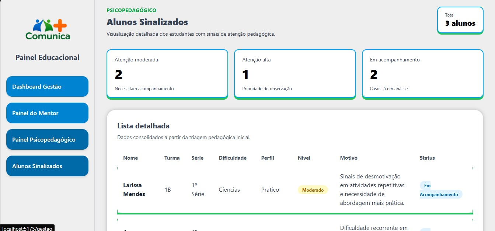
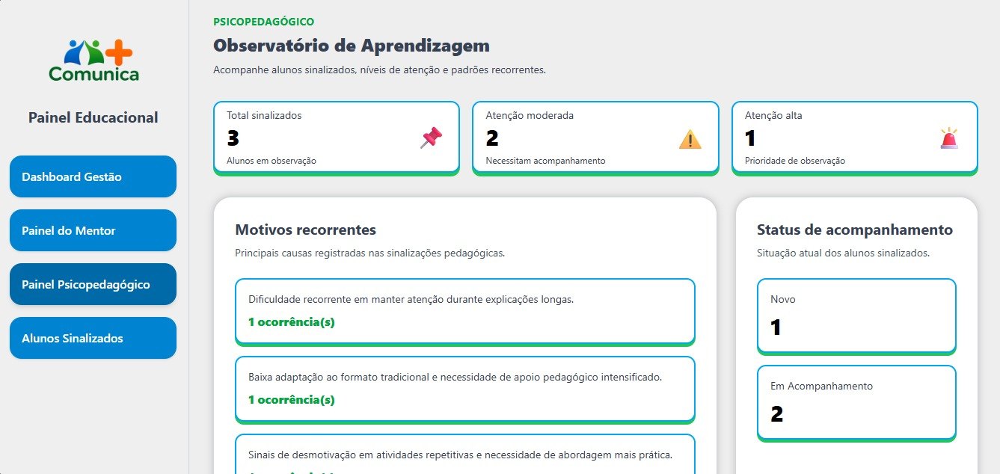
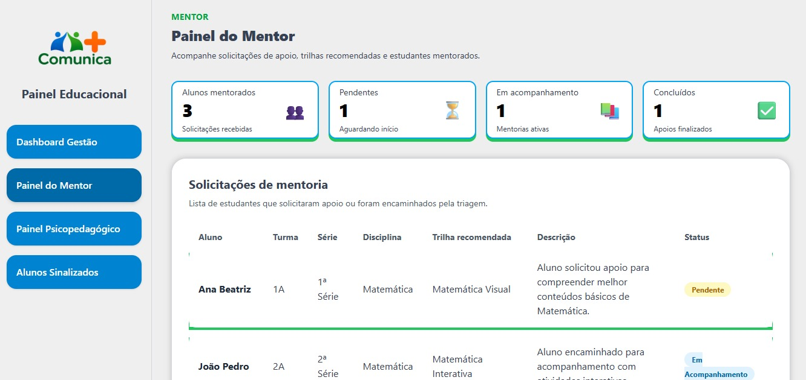

# Comunica+ — Comunicação, Mentoria e Protagonismo Estudantil

> Plataforma educacional criada para aproximar estudantes, mentores, gestão escolar e apoio pedagógico, facilitando pedidos de ajuda, acompanhamento de dificuldades, trilhas de aprendizagem e acesso a oportunidades.

---

## Sobre o Projeto

O **Comunica+** é uma solução educacional desenvolvida para apoiar estudantes do ensino médio e técnico da rede pública no processo de aprendizagem, orientação e acompanhamento escolar.

A proposta nasceu da percepção de que muitos alunos enfrentam dificuldades acadêmicas, emocionais ou de orientação, mas nem sempre conseguem pedir ajuda diretamente. Seja por timidez, falta de um canal adequado ou ausência de acompanhamento individualizado, muitos estudantes acabam passando por dificuldades de forma silenciosa.

O Comunica+ busca reduzir essa distância por meio de uma plataforma digital que conecta estudantes, mentores, gestão escolar e apoio pedagógico em um ambiente organizado, acessível e funcional.

---

## Problema Identificado

Dentro do ambiente escolar, muitos estudantes apresentam dificuldades em disciplinas, dúvidas sobre carreira, desmotivação ou necessidade de orientação. No entanto, nem sempre esses alunos procuram ajuda.

Entre os principais desafios identificados estão:

- Timidez ou insegurança para pedir apoio diretamente;
- Falta de um canal simples para registrar dificuldades;
- Dificuldade da gestão escolar em identificar alunos que precisam de acompanhamento;
- Pouca integração entre estudante, mentor e equipe pedagógica;
- Ausência de dados organizados para apoiar decisões educacionais;
- Falta de acompanhamento individualizado em tempo adequado.

Esses fatores podem contribuir para o desengajamento, baixo rendimento e perda de oportunidades dentro da trajetória escolar do estudante.

---

## Solução Proposta

O **Comunica+** centraliza o processo de apoio ao estudante em um ecossistema digital com diferentes perfis de acesso.

A solução permite que o aluno registre suas dificuldades, realize triagens, receba trilhas de aprendizagem e solicite apoio. Ao mesmo tempo, mentores, gestão escolar e apoio pedagógico conseguem acompanhar essas informações de forma organizada.

A plataforma atua em três frentes principais:

### Estudante

O estudante pode informar suas dificuldades, acessar trilhas de apoio, visualizar oportunidades e solicitar acompanhamento de maneira mais simples e menos constrangedora.

### Mentor

O mentor acompanha alunos, visualiza suas principais dificuldades, analisa trilhas recomendadas e orienta o estudante durante o processo de aprendizagem.

### Gestão Escolar e Apoio Pedagógico

A gestão escolar e os profissionais de apoio pedagógico acompanham indicadores, solicitações e dados gerais para identificar necessidades, organizar intervenções e tomar decisões com mais clareza.

> O Comunica+ não substitui o trabalho pedagógico da escola. Ele atua como uma ferramenta de apoio para tornar o acompanhamento estudantil mais organizado, rápido e acessível.

---

## Público-Alvo

O público principal do Comunica+ são estudantes do ensino médio e técnico da rede pública, especialmente aqueles que precisam de apoio acadêmico, orientação educacional ou acompanhamento mais próximo.

Também fazem parte do público da solução:

- Mentores;
- Professores;
- Gestão escolar;
- Profissionais de apoio pedagógico;
- Psicopedagogos ou psicopedagogas;
- Equipes responsáveis pelo acompanhamento estudantil.

---

## Funcionalidades do MVP

O projeto está sendo desenvolvido como um MVP para validação em ambiente de hackathon educacional.

### Implementadas ou em estruturação

- Estrutura do backend em Laravel;
- Estrutura da aplicação web em React;
- Estrutura inicial do aplicativo mobile em Flutter;
- Cadastro e organização de usuários;
- Perfis de acesso;
- Dashboard inicial da gestão;
- Painel inicial do mentor;
- Painel psicopedagógico;
- Tela de alunos sinalizados;
- Organização inicial de trilhas e dificuldades;
- Estrutura para triagem estudantil;
- Base inicial para acompanhamento dos estudantes;
- Indicadores visuais de dificuldade e atenção pedagógica.

### Em desenvolvimento

- Integração completa entre backend, web e mobile;
- Notificações;
- Recomendações automáticas de trilhas;
- Área de oportunidades;
- Relatórios avançados;
- Melhorias de acessibilidade;
- Evolução do painel do estudante;
- Melhorias visuais nos painéis;
- Testes com usuários.

---

## Telas do Sistema

Abaixo estão algumas telas desenvolvidas para o MVP do Comunica+, demonstrando os principais painéis da plataforma.

### Dashboard da Gestão

Tela principal da gestão escolar, com visão geral dos alunos cadastrados, alunos ativos, trilhas recomendadas, atenção pedagógica, panorama de dificuldades e perfis predominantes de aprendizagem.


---

### Painel de Alunos Sinalizados

Tela voltada ao acompanhamento detalhado dos estudantes que apresentaram sinais de atenção pedagógica, exibindo níveis de prioridade, status de acompanhamento, dificuldade identificada, perfil de aprendizagem e motivo da sinalização.



---

### Observatório de Aprendizagem

Painel psicopedagógico para visualização dos motivos recorrentes nas sinalizações, níveis de atenção e status atual dos alunos em acompanhamento.



---

### Painel do Mentor

Tela destinada aos mentores, permitindo visualizar estudantes mentorados, solicitações pendentes, acompanhamentos ativos, apoios concluídos e trilhas recomendadas para cada aluno.



---

## Perfis de Usuário

O Comunica+ foi pensado para atender diferentes perfis dentro do ambiente escolar.

### Estudante

Usuário principal da plataforma. Pode registrar dificuldades, acessar trilhas de apoio, solicitar acompanhamento e visualizar oportunidades.

### Mentor

Responsável por acompanhar estudantes, analisar dificuldades e orientar o aluno em sua jornada de aprendizagem.

### Gestão Escolar

Acompanha dados gerais, solicitações, indicadores e informações relevantes para tomada de decisão.

### Apoio Pedagógico/Psicopedagógico

Perfil voltado ao acompanhamento mais específico dos estudantes, com acesso a dados de triagem e informações que auxiliem na identificação de necessidades de apoio.

### Administrador do Sistema

Responsável pela organização geral da plataforma, gerenciamento de usuários, permissões e configurações.

---

## Arquitetura da Solução

A arquitetura do Comunica+ foi organizada em três módulos principais: **Backend**, **Web** e **Mobile**.

```text
Comunica+
├── Backend — Laravel + MySQL + API REST
│   └── Regras de negócio, autenticação, usuários, triagens e trilhas
│
├── Web — React + Vite + Tailwind CSS
│   └── Painéis da gestão, mentor e apoio pedagógico
│
└── Mobile — Flutter
    └── Aplicativo do estudante
```

Essa separação permite maior organização, escalabilidade e facilidade de manutenção durante o desenvolvimento do MVP.

---

## Tecnologias Utilizadas

### Backend

* Laravel
* PHP
* MySQL
* API REST

### Frontend Web

* React
* Vite
* Tailwind CSS
* JavaScript

### Mobile

* Flutter
* Dart

### Controle de Versão

* Git
* GitHub
* Branches de desenvolvimento
* Pull Requests
* Commits organizados por tarefa

---

## Estrutura do Repositório

```text
comunica-plus/
├── backend/      # API e regras de negócio em Laravel
├── web/          # Painéis web em React
├── mobile/       # Aplicativo do estudante em Flutter
├── docs/         # Documentações e imagens do projeto
└── README.md     # Documentação principal
```

Cada pasta possui uma responsabilidade específica dentro da solução, facilitando o trabalho em equipe e a manutenção do projeto.

---

## Como Executar o Projeto

Cada módulo do Comunica+ deve ser executado separadamente.

### 1. Clonar o repositório

```bash
git clone https://github.com/GrupoLmd/comunica-plus.git
cd comunica-plus
```

### 2. Executar o Backend

Entre na pasta do backend:

```bash
cd backend
```

Instale as dependências:

```bash
composer install
```

Copie o arquivo de ambiente:

```bash
cp .env.example .env
```

Gere a chave da aplicação:

```bash
php artisan key:generate
```

Configure o banco de dados no arquivo `.env`.

Depois execute as migrations:

```bash
php artisan migrate
```

Inicie o servidor Laravel:

```bash
php artisan serve
```

O backend ficará disponível em:

```text
http://127.0.0.1:8000
```

### 3. Executar o Web

Volte para a raiz do projeto e entre na pasta web:

```bash
cd ../web
```

Instale as dependências:

```bash
npm install
```

Inicie o servidor de desenvolvimento:

```bash
npm run dev
```

O painel web será executado pelo Vite, geralmente em:

```text
http://localhost:5173
```

### 4. Executar o Mobile

Volte para a raiz do projeto e entre na pasta mobile:

```bash
cd ../mobile
```

Instale as dependências do Flutter:

```bash
flutter pub get
```

Execute o aplicativo:

```bash
flutter run
```

---

## Fluxo de Contribuição da Equipe

O desenvolvimento do Comunica+ utiliza GitHub para organização, versionamento e colaboração entre os participantes.

Para manter o repositório organizado, a equipe deve evitar alterações diretas na branch principal.

### Fluxo recomendado

* Criar uma branch para a tarefa;
* Fazer as alterações necessárias;
* Realizar commits com mensagens claras;
* Enviar a branch para o GitHub;
* Abrir um Pull Request;
* Revisar as alterações;
* Integrar à branch principal.

### Exemplos de nomes de branches

```text
feature/painel-mentor
feature/dashboard-gestao
feature/mobile-estudante
fix/correcao-login
docs/atualizacao-readme
```

### Exemplos de mensagens de commit

```text
feat: cria estrutura inicial do painel do mentor
fix: corrige rota de login
docs: atualiza documentação do projeto
style: ajusta layout da dashboard
```

Esse fluxo ajuda a demonstrar organização, colaboração e participação real da equipe no desenvolvimento do projeto.

---

## Equipe

O Comunica+ foi desenvolvido por uma equipe de estudantes com responsabilidades distribuídas entre programação, documentação, ideação, apresentação e análise dos desafios escolares.

### Integrantes

* Raniely Inacio de Sousa
* Marillia Ferreira do Vale
* Luana Marques de Ananias
* Luis Miguel Lira Do Nascimento
* Juciele da Silva Santos

### Orientador

* Mayke Lombardo

### Organização da Equipe

Durante o desenvolvimento do MVP, a equipe foi organizada para garantir participação ativa em diferentes áreas do projeto:

* Desenvolvimento da solução;
* Organização da documentação;
* Levantamento do problema;
* Construção da proposta;
* Apresentação da ideia;
* Validação das funcionalidades;
* Explicação da arquitetura do sistema.

Essa divisão permitiu que cada integrante contribuísse de forma prática para o desenvolvimento e apresentação do Comunica+.

---

## Observação Final

O Comunica+ é mais do que uma plataforma digital. É uma proposta de aproximação entre estudantes e pessoas capazes de ajudá-los.

Ao transformar dificuldades silenciosas em dados visíveis e pedidos de apoio em acompanhamento organizado, o projeto busca contribuir para uma escola mais acolhedora, conectada e preparada para apoiar seus alunos.


Ao transformar dificuldades silenciosas em dados visíveis e pedidos de apoio em acompanhamento organizado, o projeto busca contribuir para uma escola mais acolhedora, conectada e preparada para apoiar seus alunos.
